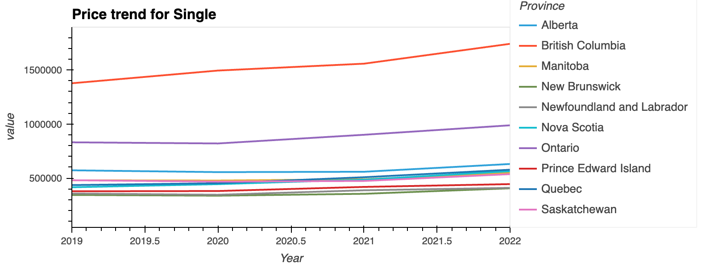

# **Project 1: Canada Real Estate Analysis**
* Project name: CYBERNEST_Housing
* Course title: Fintech Bootcamp
* Group members: Emma, Parastoo, Shewta, Haihua
* Date: July 10th

## **Table of Contents**

- [Project Objective](#project-objective)
- [Dependencies](#dependencies)
- [Data Cleanup & Exploration](#data-cleanup--exploration)
- [How to Use](#how-to-use)
- [Data Analysis](#data-analysis)
- [Results](#results)
    - [Question 1](#question-1-how-have-housing-prices-changed-over-the-years-across-different-provinces)
    - [Question 2](#question-2-whats-the-overall-housing-market-return-in-each-province-over-the-past-4-years)
    - [Question 3](#question-3-what-is-the-most-popular-type-of-house-and-its-corresponding-units-sold-in-each-province-in-2022)
    - [Question 4](#question-4-which-price-range-demonstrates-the-highest-market-demand-indicated-by-the-most-absorbed-units-and-how-does-this-demand-vary-across-different-provinces)
    - [Question 5](#question-5-given-the-average-income-for-each-province-what-type-of-house-can-the-average-person-or-household-realistically-afford-how-does-this-vary-across-different-provinces)
    - [Question 6](#question-6-identify-provinces-in-canada-where-the-user-could-potentially-afford-to-buy-a-house-based-on-their-personal-financial-situation)
    - [Question 7](#question-7-how-have-the-real-estate-related-stocks-performed-over-the-past-4-years-what-is-the-stock-beta-for-selected-real-estate-and-construction-companies-and-how-does-it-contribute-to-our-understanding-of-their-risk-profiles-and-market-performances)
- [Postmortem](#postmortem)
- [Conclusion](#conclusion)

</br>

## **Project Objective**

This project conducts a comprehensive analysis of Canada's real estate market using various data sets. The objective is to understand the housing market in different provinces, identify the most popular house types, understand market demand based on price range, and evaluate the affordability of houses in different provinces. Additionally, we will perform a risk analysis of real estate-related stocks.


Here's a summary of the questions answered in this analysis:

1. **How have housing prices changed over the years across different provinces?**
    
    - *Why*: Understanding housing price changes over time allows us to identify market trends and potential investment opportunities.

2. **What's the overall housing market return in each province over the past 4 years?**
    
    - *Why*: By assessing the market trend in each province, we can identify areas of high growth and potential areas of concern.

3. **What is the most popular type of house and its corresponding units sold in each province in 2022?**

    - *Why*: Knowledge about the most popular housing types can be beneficial for real estate developers and investors to plan their projects effectively.

4. **Which price range demonstrates the highest market demand, indicated by the most absorbed units, and how does this demand vary across different provinces?**

    - *Why*: Understanding market demand by price range can help developers price their projects competitively and investors to make informed decisions.

5. **Given the average income for each province, what type of house can the average person or household realistically afford? How does this vary across different provinces?**

    - *Why*: This can provide insights into affordability levels and identify provinces where housing is more or less affordable based on average income levels.

6. **Identify provinces in Canada where the user could potentially afford to buy a house, based on their personal financial situation.**

    - *Why*: To offer a better user experience and provide personalized insights, we show also have some interactive elements to provides feedback on which provinces and types of houses the user can afford.

7. **How have the real estate-related stocks performed over the past 4 years? What is the stock beta for selected real estate and construction companies, and how does it contribute to our understanding of their risk profiles and market performances?**
    
    - *Why*: Given the high cost associated with direct property ownership, investing in real estate-related stocks provides a more affordable avenue for individuals to gain exposure to the real estate market. Evaluating the performance and risk of these stocks can offer invaluable insights for potential investors, guiding them to make informed decisions and better understand the inherent risk profiles and market performance of these companies.

</br>

**Summary of findings**
The questions were  answered in our detailed analysis, and they provided valuable insights into the real estate market in Canada.

Our findings showed that there were significant variations in housing trends and market demand across provinces. Some provinces had more preference for certain types of houses, and affordability also varied greatly. Additionally, we found that the risk and performance of real estate-related stocks varied, providing an additional perspective for potential investors.  

</br>

## **Dependencies**

This project requires the following Python libraries:

- Pandas
- NumPy
- Path
- Datetime
- HvPlot
- Holoviews
- Matplotlib
- Seaborn
- Plotly (new)
- Mortgage (new)

</br>

## **How to Use**

The notebook includes a interactive function. During the affordability analysis, users will be prompted to input their personal financial details. Please follow the on-screen instructions to input the necessary information. 

The `find_affordable_house()` function will ask the user for their mortgage rate, term, down payment percentage, and income, and then print the provinces and house types that they can afford. If they don't provide any input and just press enter, the function will use the default values (5% rate, 25 years term, 20% down payment, $50000 annual income).

</br>

## **Data Cleanup & Exploration**

### Data
The project uses the following data sources:

- Housing price data from the Canada Mortgage and Housing Corporation ([CMHC](https://www.cmhc-schl.gc.ca/professionals/housing-markets-data-and-research/housing-data/data-tables/housing-market-data/absorbed-units-price-range))
- Average income data for each province (From [CMHC](https://www.cmhc-schl.gc.ca/search#q=average%20income&sort=relevancy))
- Real estate-related stocks data (From [Yahoo Finance](https://ca.finance.yahoo.com/quote/REI-UN.TO/history?p=REI-UN.TO)) 
- Gerographic data for each province (From [LatLong.net](https://www.latlong.net/category/provinces-40-60.html))

</br>

### Cleanup & Exploration Process

Upon determining that our research topic would revolve around Canada real estate, we initially attempted to acquire the necessary data from Statistics Canada and MLS. However, this process came with its own set of challenges.

We discovered that the data from MLS was embedded within PDF files, which made extraction of the necessary information quite challenging. Meanwhile, the data from Statistics Canada had a high level of redundancy. There were inconsistencies in the statistical calibrations across different years, complications in terms of housing classification, regional differences, and issues related to level of detail of the data.

After much exploration, we found a more reliable source of data from the Canadian Mortgage and Housing Corporation (CMHC). The CMHC data encompassed details of 'absorbed units,' representing sales data of newly constructed houses. Interestingly, from our initial observation of MLS data, we found no significant difference in prices between new and pre-owned houses within the same area. Moreover, the CMHC provided us with data from several consistent years in a uniform format. This led us to use CMHC's data for our core housing information, specifically focusing on absorbed units by price range (from year 2019 to 2022).

Despite the issues encountered during the data cleanup and exploration phase, they led us to a more robust and reliable dataset. This unexpected outcome gave us greater confidence in the subsequent analysis. The visualization and further exploration of this data are available within our Jupyter Notebook, demonstrating intriguing trends and insights in the Canadian real estate market.

Additionally, we obtained historical stock data of two highly representative companies related to real estate from Yahoo Finance. One is a **Real Estate Investment Trust (REIT)**, and the other is a **Construction Development Company**.

    A Real Estate Investment Trust (REIT) is a company that owns, operates, or finances income-generating real estate. Modeled after mutual funds, REITs pool the capital of numerous investors. This makes it possible for individual investors to earn dividends from real estate investments—without having to buy, manage, or finance any properties themselves. 

Through our study, we aim to explore the stock performance of these two representative entities in the real estate market, providing a view of real estate related stocks as an alternative investment.

</br>

## **Data Analysis**

In order to effectively analyze the data we gathered and respond to our proposed questions, we carried out several steps.

### Step 1: Data Parsing and Cleaning
As mentioned earlier, we acquired housing data from CMHC and stock data from Yahoo Finance. Both sets of data came in different formats and had their own quirks. In order to make them work together, we had to clean and parse them accordingly.

For the housing data, we parsed the absorbed unit data by price range from CMHC's data. We also had to handle multiple issues such as data duplication, inconsistencies in statistical measurements across different years, and varying data accuracy across provinces. We mitigated these issues as much as possible to ensure the integrity of our data.

In regards to the stock data, we downloaded historical data for a Real Estate Investment Trust (REIT) and a construction development company, which are the two representative entities in our study. The data was already well structured, hence only minimal cleaning was required.

### Step 2: Data Merging
After cleaning and parsing the data, we merged the datasets to allow for comparison and analysis. We implemented the merge on the basis of date to enable us to track changes over time in both housing and stock data.

### Step 3: Data Analysis and Visualization
Following the data merge, we started analyzing the combined data. Our focus was on understanding how the real estate market and stock market performed over the same period, and how various factors influenced both. We implemented various data visualization techniques to illustrate these relationships. We used Jupyter Notebook to create these visualizations, which included time series plots, histograms, scatter plots, and more.

### Step 4: Plot File Upload and Result Documentation
After data analysis and visualization, we saved the generated plots and uploaded the files for easy accessibility. Alongside this, we documented our findings and interpretations based on the analysis and visualizations, providing an informed conclusion to our research questions.

</br>

## **Results**

The analysis results are presented as data tables, charts, graphs and interacted function. These visualizations provide a detailed insight into the Canadian housing market, showcasing variations in housing prices, market trends, popular house types, demand by price range, and affordability across provinces.

</br>

### **Question 1: How have housing prices changed over the years across different provinces?**

Logic: 

Using Weighted Average Price for each house type

In our data, we have different price ranges for each house type. To offer a more comprehensive view of the housing market trend, we took the weighted average price for each house type.

For example:

Weighted Average Price (Single-Family House, 2019)=

[(# of unit from 1st price range in 2019 * midpoint price of 1st price range) / total unit in 2019] +

[(# of unit from 2nd price range in 2019 * midpoint price of 2nd price range) / total unit in 2019] +
 
... (so on for all price ranges)

Findings:

* The pandemic had varying impact on real estate across provinces. The demand for spacious homes with more indoor and outdoor space increased. As economies reopened and vaccination efforts progressed, real estate economy started to stabilize.


<table>
  <tr>
    <td>  </td>
    <td>  </td>
  </tr>
  <tr>
    <td>  </td>
    <td>  </td>
  </tr>
</table>

### **Question 2: What's the overall housing market return in each province over the past 4 years?**

Logic: 

Using Single-Family House price as reference for return on housing market.

The data ('housing_price_df') includes the weighted average price for houses across different provinces in Canada. For the purposes of our analysis, we have decided to use the price of single houses as a reference point to gauge returns in the housing market. This decision was motivated by several factors.

First, single houses are a common and popular type of residential property in Canada. They represent a significant portion of the housing market and thus serve as a reliable indicator of market trends.

Second, by focusing on one specific type of property, we can control for variations in price that might occur due to differences in property type. This ensures that our analysis of housing returns is more consistent and reliable, as it won't be influenced by differences in the characteristics or demand for different types of properties.

Findings:

* Provinces such as QC, BC and NS experienced stronger price growth for Single houses due to Covid aftermath, while others see more moderate fluctuation in price changes.

* The highest increase in cumulative growth for single houses in provinces such as BC, NS and Quebec indicates a strong appreciation for this type of housing. This growth signifies a rise in property prices due to factors such as high demand, limited supply.

* Single family homes typically attract stronger demand especially during period of economic recovery in 2020. Single family homes in province such as BC and NS experience positive annual return trends as they offer robust housing market. 

* In year 2020, Factors such as job economic downturns oversupply of rental attribute to negative annual return in province such as Alberta and Ontario.


<table>
  <tr>
    <td>  </td>
    <td>  </td>
  </tr>
  <tr>
    <td>  </td>
    <td>  </td>
  </tr>
</table>


### **Question 3: What is the most popular type of house and its corresponding units sold in each province in 2022?**

Findings:

* During COVID-19, there was increased demand for spacious single-family homes and semi detached homes in Canadian provinces. Apartment faced temporary challenges but saw a rebound in demand after the pandemic as urban areas reopened and rental market strengthened.

* Ontario faced some temporary challenges due to lifestyle changes and economic uncertainties but experienced a resurgence in demand once city reopened.

.png)

### **Question 4: Which price range demonstrates the highest market demand, indicated by the most absorbed units, and how does this demand vary across different provinces?**

Findings:

* Strong market demand in Ontario for properties range up to $1.6 million. Covering a significant portion of market, including property types such as single family homes, townhouse and some luxury properties.

* In BC the market demand up to $3 million focuses on higher-end properties and desirable locations such as Vancouver and its surrounding areas.

* In Alberta, the market demand up to $1.2 million encompasses a wide range of property types, including detached, semi-detached, town-homes and some luxury properties.

.png)

### **Question 5: Given the average income for each province, what type of house can the average person or household realistically afford? How does this vary across different provinces?**

Logic:

* When setting the `Affordable Price` for houses, we made the assumption that a potential home buyer would allocate 30% of their annual income to mortgage payments and aim to repay their mortgage within 25 years. Therefore, for each province, we calculated the affordable price as the average income multiplied by 30%, and then multiplied by 25 years. 
* ```Affordable_Price = Avg Income * 30% * 25``` 
* This calculation helps provide a benchmark to evaluate the affordability of housing in different provinces. 


Findings:

* In BC and ON, it is impossible for anyone with average income to afforad any type of house.


.png)

### **Question 6: Identify provinces in Canada where the user could potentially afford to buy a house, based on their personal financial situation.**

Logic:
* Using a new libarary called `mortgage` to calculate the mortgage payment.

* To offer a better user experience and provide personalized insights, we designed an interactive function. This function allows users to input their financial situation (income, mortgage rate, downpayment etc.). Based on this input, the tool provides feedback on which provinces and types of houses the user can afford.

* This functionality aims to provide practical advice to users, helping them understand where and what type of real estate would be within their financial reach, and potentially guiding their investment or homeownership decisions. This not only adds an interactive element to the project but also brings the data analysis closer to users' real-world considerations.

<div align="center">
    
</div>

### **Question 7: How have the real estate-related stocks performed over the past 4 years? What is the stock beta for selected real estate and construction companies, and how does it contribute to our understanding of their risk profiles and market performances?**

Findings:

* During the covid-19, daily return of Triocon a construction company displays decreases due to lockdown challenges and economic uncertainty. This company was impacted by distruptions in supply chains and project delays.

* Daily returns are crucial performance indicators that measure changes in an investment's value from one trading day to the next. Analyzing the daily returns of real estate and construction companies allows us to assess their performance and relative strength.

* Rolling beta measures how a stock's returns respond to market changes over a specific period. By calculating the rolling beta for our portfolio stocks, we can understand their risk profiles and adapt to market movements. Monitoring these fluctuations is vital for effective risk management.

<table>
  <tr>
    <td colspan="2">  </td>
  </tr>
  <tr>
    <td>  </td>
    <td>  </td>
  </tr>
  <tr>
    <td>  </td>
    <td>  </td>
  </tr>
</table>


</br>

## **Postmortem**

</br>

### Discuss any difficulties that arose, and how they were handled.

Throughout our project, we encountered several difficulties both in data preparation and analysis. The section will focus on particular issues arising during the data visualization process.

1. **Using melt() function**

    For instance, from our [Plot#1](./Plot/bokeh_plot.png), we aimed to display the housing price trends of different provinces on the same plot, labeled by color. In our first iteration, we used a *for loop* to individually plot data for each province and then overlaid them on a line chart. The reason for this approach was our table was in wide format, where each row contained multiple data points (e.g., a single row for Ontario in 2021 included sales data for four different house types). This meant when creating our charts, we had to manage four parameters: year, province, house type, and price, which couldn't all be represented in a 2D line chart at once. Thus, we looped through each province separately and split the four house types into individual charts, with each only having two parameters (year for the x-value and price for the y-value), enabling us to create our initial line charts.

    This approach did allow us to create the graphs, but an unforeseen issue forced us to abandon this method: we found it impossible to add a legend to the chart. This meant that viewers of the chart couldn't tell which line represented which province, rendering the chart meaningless.

    We subsequently did some research and discovered the `melt()` function in pandas. This function converts a DataFrame from wide format to long format, meaning that each row of our table would now contain only a single data point. For example, the 2021 sales for single-family homes in Ontario became a separate row.

    After this transformation, we could easily use `hvplot()` to create the chart all at once, eliminating the need for a for loop to draw each line and overlay them.

2. **Using OSM as base layer**

    We also encountered significant challenges while creating a map plot. Initially, we used `hvplot.points()` to create a map plot where the circle size represented the number of units sold, with different colors indicating different house types. The circles were positioned on the map according to their 'Longitude' and 'Latitude'.

    However, we couldn't find a way to add labels to the circles, which made it difficult for users to understand which circle represented which province. This left our first version of the map plot meaningless.

    Ultimately, we discovered that we could resolve this issue by drawing the circles and labels `hvplot.labels()` separately. Then, we used OpenStreetMap tiles as the base map. Overlaying the drawn circles and labels on this base map provided us with a meaningful and easy-to-understand visualization.

</br>

### Discuss any additional questions that arose, which couldn't be answered due to time constraints. What would you research next if you had two more weeks?

1. **Comparison Between Owning Houses and Investing in the Stock Market**

    One of our initial areas of interest was understanding the correlation between real estate-related stocks and the housing market. Unfortunately, we were unable to find sufficient data to perform this analysis. Furthermore, the number of data points we had was not sufficient (n>25) to calculate a reliable annual standard deviation for housing prices.

2. **Pre-Covid vs Post-Covid Analysis**

    Given more time, we would be keen to compare housing data from two different periods, namely 2014-2018 and 2019-2022. Our goal would be to understand if the pandemic has fundamentally altered the dynamics of Canada's housing market.

</br>

## **Conclusion**

This project provides a comprehensive overview of the real estate market in Canada. It's a useful resource for understanding housing trends and affordability across different provinces. The risk analysis of real estate-related stocks offers valuable insights for investors interested in this sector.
